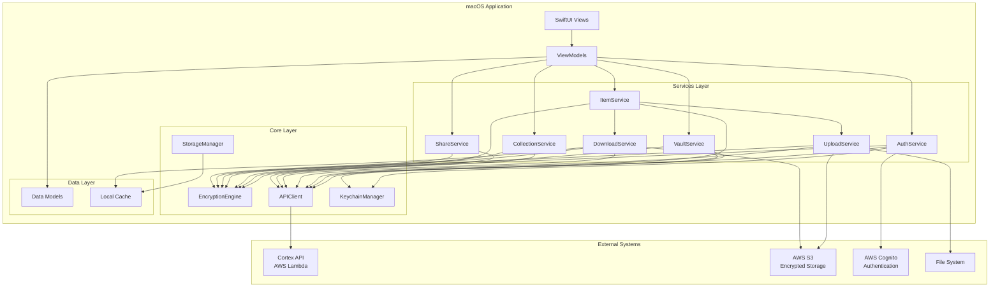

# Design Document: Cortex macOS Native Application

## Overview

The Cortex macOS Native Application is a privacy-first media backup client built with Swift 5.9+ and SwiftUI, targeting macOS 13.0 (Ventura) and later. The application implements a zero-knowledge architecture where all encryption and decryption operations occur exclusively on the client device, ensuring the backend never has access to unencrypted user data.

The application follows the MVVM (Model-View-ViewModel) architectural pattern with clear separation of concerns across five primary modules: UI (SwiftUI views), Networking (API client), Encryption (cryptographic operations), Storage (local persistence), and Models (data structures). This modular design enables maintainability, testability, and scalability while adhering to Swift and macOS best practices.

Key technical decisions include:
- **CryptoKit + CryptoSwift**: Native Apple CryptoKit for ChaCha20-Poly1305 encryption, supplemented with CryptoSwift for additional cryptographic primitives
- **Argon2Swift**: Swift wrapper around the reference C implementation of Argon2id for key derivation
- **URLSession**: Native networking with async/await for API communication
- **Keychain Services**: Secure credential storage using macOS Keychain
- **Swift Concurrency**: Async/await and actors for thread-safe operations

## Architecture

### High-Level Architecture Diagram



### Module Organization

```
CortexMacOS/
├── App/
│   ├── CortexMacOSApp.swift          # App entry point
│   └── AppDelegate.swift             # App lifecycle, menu bar
├── UI/
│   ├── Views/
│   │   ├── Auth/
│   │   │   ├── LoginView.swift
│   │   │   ├── SignUpView.swift
│   │   │   └── RecoveryView.swift
│   │   ├── Main/
│   │   │   ├── MainView.swift
│   │   │   ├── SidebarView.swift
│   │   │   └── ContentView.swift
│   │   ├── Items/
│   │   │   ├── ItemGridView.swift
│   │   │   ├── ItemDetailView.swift
│   │   │   └── ItemViewerView.swift
│   │   ├── Collections/
│   │   │   ├── CollectionListView.swift
│   │   │   └── CollectionDetailView.swift
│   │   ├── Upload/
│   │   │   ├── UploadQueueView.swift
│   │   │   └── UploadProgressView.swift
│   │   ├── Settings/
│   │   │   └── PreferencesView.swift
│   │   └── MenuBar/
│   │       └── MenuBarView.swift
│   ├── ViewModels/
│   │   ├── AuthViewModel.swift
│   │   ├── VaultViewModel.swift
│   │   ├── ItemViewModel.swift
│   │   ├── CollectionViewModel.swift
│   │   ├── UploadViewModel.swift
│   │   └── SettingsViewModel.swift
│   └── Components/
│       ├── LoadingView.swift
│       ├── ErrorView.swift
│       └── ThumbnailView.swift
├── Services/
│   ├── AuthService.swift
│   ├── VaultService.swift
│   ├── ItemService.swift
│   ├── CollectionService.swift
│   ├── ShareService.swift
│   ├── UploadService.swift
│   ├── DownloadService.swift
│   └── RecoveryService.swift
├── Core/
│   ├── Encryption/
│   │   ├── EncryptionEngine.swift
│   │   ├── KeyDerivation.swift
│   │   ├── ChaCha20Poly1305.swift
│   │   └── TagEncryption.swift
│   ├── Networking/
│   │   ├── APIClient.swift
│   │   ├── APIEndpoints.swift
│   │   ├── APIRequest.swift
│   │   └── APIResponse.swift
│   ├── Storage/
│   │   ├── StorageManager.swift
│   │   ├── CacheManager.swift
│   │   └── ThumbnailCache.swift
│   ├── Keychain/
│       └── KeychainManager.swift
├── Models/
│   ├── User.swift
│   ├── Vault.swift
│   ├── Item.swift
│   ├── Collection.swift
│   ├── Share.swift
│   ├── UploadTask.swift
│   └── EncryptedMetadata.swift
├── Utilities/
│   ├── Extensions/
│   │   ├── Data+Extensions.swift
│   │   ├── String+Extensions.swift
│   │   └── Date+Extensions.swift
│   ├── Constants.swift
│   ├── Logger.swift
│   └── PasswordValidator.swift
└── Resources/
    ├── Assets.xcassets
    └── Info.plist
```

## Components and Interfaces

### 1. EncryptionEngine

The EncryptionEngine is the core cryptographic component responsible for all encryption, decryption, and key derivation operations.

**Responsibilities:**
- Derive vault master key from vault password using Argon2id
- Derive specific keys (data encryption, metadata encryption, share key derivation) using HKDF
- Encrypt and decrypt data using ChaCha20-Poly1305
- Encrypt tags deterministically using HMAC-SHA256
- Generate cryptographically secure random nonces

**Interface:**
```swift
actor EncryptionEngine {
    // Key Derivation
    func deriveVaultMasterKey(
        password: String,
        salt: Data
    ) async throws -> Data
    
    func deriveDataEncryptionKey(
        masterKey: Data
    ) throws -> SymmetricKey
    
    func deriveMetadataEncryptionKey(
        masterKey: Data
    ) throws -> SymmetricKey
    
    func deriveShareKey(
        masterKey: Data,
        shareId: String
    ) throws -> SymmetricKey
    
    // Encryption/Decryption
    func encrypt(
        data: Data,
        key: SymmetricKey
    ) throws -> EncryptedData
    
    func decrypt(
        encryptedData: EncryptedData,
        key: SymmetricKey
    ) throws -> Data
    
    // Tag Encryption (Deterministic)
    func encryptTag(
        tag: String,
        key: SymmetricKey
    ) throws -> Data
    
    // Nonce Generation
    func generateNonce() throws -> Data
}

struct EncryptedData {
    let ciphertext: Data
    let nonce: Data
    let tag: Data
}
```

**Implementation Details:**
- Uses CryptoKit's `ChaChaPoly` for ChaCha20-Poly1305 encryption
- Uses Argon2Swift for Argon2id key derivation with parameters: 64MB memory, 3 iterations, 4 parallelism
- Uses CryptoKit's `HKDF` for key derivation with specific context strings
- Uses CryptoKit's `HMAC<SHA256>` for deterministic tag encryption
- Implemented as an actor to ensure thread-safe access to cryptographic operations
- All operations are async to avoid blocking the main thread

### 2. APIClient

The APIClient handles all HTTP communication with the Cortex backend API.

**Responsibilities:**
- Execute HTTP requests with proper authentication
- Handle token refresh automatically
- Implement retry logic with exponential backoff
- Parse responses and handle errors
- Support presigned URL operations for S3

**Interface:**
```swift
actor APIClient {
    // Authentication
    func login(
        email: String,
        password: String
    ) async throws -> AuthResponse
    
    func refreshToken(
        refreshToken: String
    ) async throws -> AuthResponse
    
    func recoverAccount(
        email: String,
        recoveryCode: String
    ) async throws -> AuthResponse
    
    // Vault Operations
    func createVault(
        vaultSalt: Data,
        accessToken: String
    ) async throws -> VaultResponse
    
    func getVaultSalt(
        vaultId: String,
        accessToken: String
    ) async throws -> Data
    
    // Item Operations
    func initializeUpload(
        vaultId: String,
        encryptedMetadata: Data,
        sizeBytes: Int,
        accessToken: String
    ) async throws -> UploadInitResponse
    
    func completeUpload(
        itemId: String,
        vaultId: String,
        accessToken: String
    ) async throws -> ItemResponse
    
    func listItems(
        vaultId: String,
        itemType: ItemType?,
        pageSize: Int,
        nextToken: String?,
        accessToken: String
    ) async throws -> ItemListResponse
    
    func getItem(
        itemId: String,
        vaultId: String,
        accessToken: String
    ) async throws -> ItemResponse
    
    func getDownloadURL(
        itemId: String,
        vaultId: String,
        accessToken: String
    ) async throws -> DownloadURLResponse
    
    func deleteItem(
        itemId: String,
        vaultId: String,
        accessToken: String
    ) async throws
    
    // Collection Operations
    func createCollection(
        vaultId: String,
        encryptedMetadata: Data,
        accessToken: String
    ) async throws -> CollectionResponse
    
    func listCollections(
        vaultId: String,
        accessToken: String
    ) async throws -> [CollectionResponse]
    
    func addItemToCollection(
        collectionId: String,
        itemId: String,
        vaultId: String,
        accessToken: String
    ) async throws
    
    func removeItemFromCollection(
        collectionId: String,
        itemId: String,
        vaultId: String,
        accessToken: String
    ) async throws
    
    // Share Operations
    func createShare(
        itemId: String,
        vaultId: String,
        expiresAt: Date?,
        password: String?,
        accessToken: String
    ) async throws -> ShareResponse
    
    func revokeShare(
        shareId: String,
        accessToken: String
    ) async throws
    
    // Tag Search
    func searchByTag(
        vaultId: String,
        encryptedTag: Data,
        accessToken: String
    ) async throws -> ItemListResponse
    
    // Recovery Operations
    func generateRecoveryCodes(
        accessToken: String
    ) async throws -> [String]
    
    // S3 Operations
    func uploadToS3(
        presignedURL: URL,
        data: Data,
        progressHandler: @escaping (Double) -> Void
    ) async throws
    
    func downloadFromS3(
        presignedURL: URL,
        progressHandler: @escaping (Double) -> Void
    ) async throws -> Data
}
```

**Implementation Details:**
- Uses URLSession with async/await for all network operations
- Implements automatic token refresh when receiving 401 responses
- Implements retry logic with exponential backoff (max 3 retries)
- Uses URLSessionDelegate for upload/download progress tracking
- Validates SSL certificates
- Logs all requests/responses (excluding sensitive data)

### 3. KeychainManager

The KeychainManager provides secure storage for sensitive credentials using macOS Keychain Services.

**Responsibilities:**
- Store and retrieve account password
- Store and retrieve vault password
- Store and retrieve Cognito tokens
- Handle keychain access control
- Clear credentials on logout

**Interface:**
```swift
actor KeychainManager {
    func saveAccountPassword(
        _ password: String,
        for email: String
    ) throws
    
    func getAccountPassword(
        for email: String
    ) throws -> String?
    
    func saveVaultPassword(
        _ password: String,
        for vaultId: String
    ) throws
    
    func getVaultPassword(
        for vaultId: String
    ) throws -> String?
    
    func saveTokens(
        accessToken: String,
        refreshToken: String,
        idToken: String,
        for userId: String
    ) throws
    
    func getTokens(
        for userId: String
    ) throws -> (accessToken: String, refreshToken: String, idToken: String)?
    
    func deleteAllCredentials(
        for userId: String
    ) throws
    
    func deleteAccountPassword(
        for email: String
    ) throws
    
    func deleteVaultPassword(
        for vaultId: String
    ) throws
}
```

**Implementation Details:**
- Uses Security framework's SecItemAdd, SecItemCopyMatching, SecItemUpdate, SecItemDelete
- Sets kSecAttrAccessible to kSecAttrAccessibleWhenUnlockedThisDeviceOnly
- Uses kSecAttrSynchronizable = false to prevent iCloud sync
- Implements proper error handling for keychain operations
- Uses unique service identifiers for different credential types

### 4. UploadService

The UploadService orchestrates the complete upload flow from file selection to completion.

**Responsibilities:**
- Manage upload queue
- Encrypt files before upload
- Initialize upload with API
- Upload encrypted data to S3
- Complete upload with API
- Handle upload failures and retries
- Track upload progress

**Interface:**
```swift
actor UploadService {
    func queueUpload(
        fileURL: URL,
        vaultId: String,
        tags: [String],
        collectionIds: [String]
    ) async throws -> UploadTask
    
    func startUpload(
        taskId: String
    ) async throws
    
    func pauseUpload(
        taskId: String
    ) async throws
    
    func resumeUpload(
        taskId: String
    ) async throws
    
    func cancelUpload(
        taskId: String
    ) async throws
    
    func retryUpload(
        taskId: String
    ) async throws
    
    func getUploadProgress(
        taskId: String
    ) async -> UploadProgress?
    
    func getAllUploadTasks() async -> [UploadTask]
}

struct UploadTask: Identifiable, Codable {
    let id: String
    let vaultId: String
    let sourceURL: URL
    let tags: [String]
    let collectionIds: [String]
    var status: UploadStatus
    var progress: Double
    var error: String?
    let createdAt: Date
    var updatedAt: Date
}

enum UploadStatus: String, Codable {
    case pending
    case encrypting
    case uploading
    case completing
    case completed
    case failed
    case paused
    case cancelled
}

struct UploadProgress {
    let taskId: String
    let bytesUploaded: Int64
    let totalBytes: Int64
    let percentage: Double
    let estimatedTimeRemaining: TimeInterval?
}
```

**Implementation Details:**
- Maintains persistent upload queue using local storage
- Implements concurrent upload limit (default: 3)
- Encrypts files in chunks for large files (>100MB)
- Uses multipart upload for files >5MB
- Implements exponential backoff for retries
- Publishes progress updates via Combine
- Persists queue state across app restarts

### 5. DownloadService

The DownloadService handles downloading and decrypting items from S3.

**Responsibilities:**
- Request presigned download URLs
- Download encrypted data from S3
- Decrypt data locally
- Cache decrypted thumbnails
- Track download progress

**Interface:**
```swift
actor DownloadService {
    func downloadItem(
        itemId: String,
        vaultId: String
    ) async throws -> Data
    
    func downloadThumbnail(
        itemId: String,
        vaultId: String
    ) async throws -> Data
    
    func getCachedThumbnail(
        itemId: String
    ) async -> Data?
    
    func getDownloadProgress(
        itemId: String
    ) async -> DownloadProgress?
    
    func cancelDownload(
        itemId: String
    ) async
}

struct DownloadProgress {
    let itemId: String
    let bytesDownloaded: Int64
    let totalBytes: Int64
    let percentage: Double
    let estimatedTimeRemaining: TimeInterval?
}
```

**Implementation Details:**
- Caches decrypted thumbnails using CacheManager
- Implements LRU cache eviction policy
- Generates thumbnails for images and video frames
- Uses URLSession background downloads for large files
- Implements progress tracking via URLSessionDelegate

### 6. AuthService

The AuthService manages authentication state and operations.

**Responsibilities:**
- Handle login/logout
- Manage session state
- Refresh tokens automatically
- Handle account recovery
- Validate passwords

**Interface:**
```swift
actor AuthService {
    func login(
        email: String,
        accountPassword: String,
        vaultPassword: String
    ) async throws -> User
    
    func logout() async throws
    
    func refreshSession() async throws
    
    func recoverAccount(
        email: String,
        recoveryCode: String
    ) async throws -> User
    
    func changeAccountPassword(
        currentPassword: String,
        newPassword: String
    ) async throws
    
    func validatePassword(
        _ password: String
    ) async throws -> PasswordValidationResult
    
    func checkPasswordBreach(
        _ password: String
    ) async throws -> Bool
    
    func getCurrentUser() async -> User?
}

struct PasswordValidationResult {
    let isValid: Bool
    let errors: [PasswordValidationError]
}

enum PasswordValidationError {
    case tooShort
    case missingUppercase
    case missingLowercase
    case missingNumber
    case missingSpecialCharacter
    case breached
}
```

**Implementation Details:**
- Uses APIClient for authentication requests
- Uses KeychainManager for credential storage
- Uses EncryptionEngine for vault key derivation
- Implements Have I Been Pwned API integration (k-anonymity)
- Publishes authentication state changes via Combine
- Implements automatic token refresh before expiration

### 7. VaultService

The VaultService manages vault operations and key derivation.

**Responsibilities:**
- Create vaults
- Retrieve vault salt
- Derive vault master key
- Manage vault state

**Interface:**
```swift
actor VaultService {
    func createVault(
        vaultPassword: String
    ) async throws -> Vault
    
    func getVault(
        vaultId: String
    ) async throws -> Vault
    
    func deriveVaultKeys(
        vaultPassword: String,
        vaultSalt: Data
    ) async throws -> VaultKeys
    
    func generateVaultRecoveryKey() throws -> String
    
    func recoverVaultWithRecoveryKey(
        recoveryKey: String,
        vaultId: String
    ) async throws -> VaultKeys
}

struct VaultKeys {
    let masterKey: Data
    let dataEncryptionKey: SymmetricKey
    let metadataEncryptionKey: SymmetricKey
    let shareKeyDerivationKey: SymmetricKey
}
```

**Implementation Details:**
- Uses EncryptionEngine for key derivation
- Uses APIClient for vault operations
- Generates BIP39 mnemonic for vault recovery key
- Caches derived keys in memory (never persisted)
- Clears keys from memory on logout

## Data Models

### User
```swift
struct User: Identifiable, Codable {
    let id: String
    let cognitoId: String
    let email: String
    let createdAt: Date
    let updatedAt: Date
}
```

### Vault
```swift
struct Vault: Identifiable, Codable {
    let id: String
    let userId: String
    let vaultSalt: Data
    let createdAt: Date
    let updatedAt: Date
}
```

### Item
```swift
struct Item: Identifiable, Codable {
    let id: String
    let vaultId: String
    let userId: String
    let s3Key: String
    let encryptedMetadata: Data
    let encryptedTags: [Data]
    let uploadedAt: Date
    let sizeBytes: Int64
    let itemType: ItemType
    
    // Decrypted metadata (not persisted)
    var metadata: ItemMetadata?
    var tags: [String]?
}

enum ItemType: String, Codable {
    case media = "MEDIA"
    case note = "NOTE"
    case task = "TASK"
    case event = "EVENT"
}

struct ItemMetadata: Codable {
    let filename: String
    let creationDate: Date?
    let modificationDate: Date?
    let location: Location?
    let pixelWidth: Int?
    let pixelHeight: Int?
    let duration: TimeInterval?
    let mimeType: String?
}

struct Location: Codable {
    let latitude: Double
    let longitude: Double
}
```

### Collection
```swift
struct Collection: Identifiable, Codable {
    let id: String
    let vaultId: String
    let userId: String
    let encryptedMetadata: Data
    let createdAt: Date
    let updatedAt: Date
    let itemCount: Int
    
    // Decrypted metadata (not persisted)
    var metadata: CollectionMetadata?
}

struct CollectionMetadata: Codable {
    let name: String
    let description: String?
}
```

### Share
```swift
struct Share: Identifiable, Codable {
    let id: String
    let itemId: String
    let vaultId: String
    let userId: String
    let createdAt: Date
    let expiresAt: Date?
    let isPasswordProtected: Bool
    let isRevoked: Bool
    let accessCount: Int
    let lastAccessedAt: Date?
}
```

### EncryptedMetadata
```swift
struct EncryptedMetadata: Codable {
    let ciphertext: Data
    let nonce: Data
    let tag: Data
}
```

## Correctness Properties

*A property is a characteristic or behavior that should hold true across all valid executions of a system—essentially, a formal statement about what the system should do. Properties serve as the bridge between human-readable specifications and machine-verifiable correctness guarantees.*
